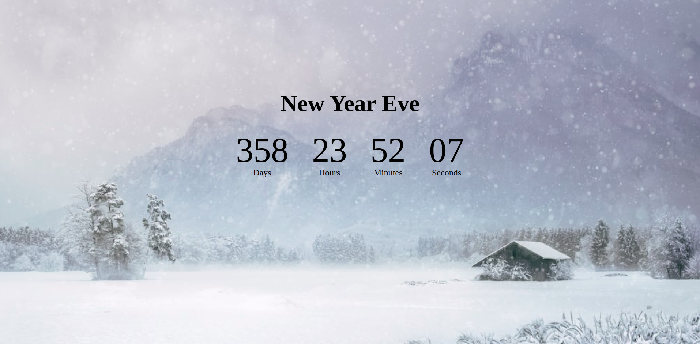

## About Countdown Timer

This project is about the Countdown timer. It actually counts the days, minutes and seconds with the upcoming years

## Visit Link

We would like to extend our thanks to the following sponsors for funding development.
If you are interested in becoming a sponsor, please visit the  [https://dip-qr-code-scanner.netlify.app/).

## Contributing

Thank you for considering contributing to Countdown timer!

## Security Vulnerabilities

If you discover a security vulnerability, please send an e-mail to DipGhosh via(mailto:dipghosh638@gmail.com). All security vulnerabilities will be promptly addressed.

## License

This is open-sourced software licensed under the [MIT license](https://opensource.org/licenses/MIT).
